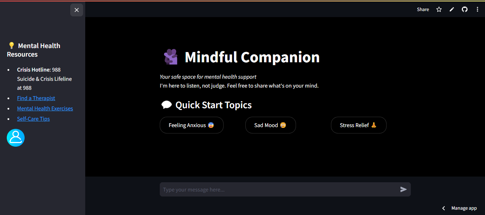

# Mindful Companion - Your AI Mental Health Conversational chatbot (BestFriend for life🌚)

Here is a hosted link to the Streamlit app: [](https://mental-health-conversational-chatbot.streamlit.app/) 

A therapeutic chatbot designed to provide emotional support and mental health resources using BERT-based NLP.



##  Overview 

**Mindful Companion**  This is an AI-powered chatbot designed to provide a safe, supportive, and non-judgmental space for mental health conversations. The chatbot assists users in managing their emotional well-being by offering empathetic responses, stress-relief strategies, and mental health resources. It is **not a replacement for professional therapy** but serves as an accessible first step for individuals seeking guidance, comfort, or emotional support bot.  

##  Purpose and Relevance 

In today’s fast-paced world, mental health challenges such as stress, anxiety, and depression are increasingly prevalent. However, many individuals hesitate to seek professional help due to **stigma, financial constraints, or lack of access to mental health services**. Mindful Companion bridges this gap by:  

- 🌍 **Providing 24/7 availability**, ensuring users have access to support whenever they need it.  
- 🗣 **Encouraging open conversations** about emotions without fear of judgment.  
- 🧘 **Offering personalized coping strategies** based on AI-driven intent recognition.  
- 📌 **Directing users to professional resources** for further assistance.  

By leveraging **BERT-based NLP models and deep learning**, the chatbot accurately understands user inputs and delivers empathetic, contextually relevant responses. This makes it a valuable tool for **early intervention and emotional self-care** in the mental health domain.  


## Features

- 🤖 BERT-powered intent recognition
- 🧠 Mental health FAQ knowledge bases
- 🚨 Crisis resource integrations
- 💬 Conversational interface with Streamlit
- 🎯 Quick-access topics for common issues
- 📚 Mental health education contents

## Technologies Used

- **NLP:** Hugging Face Transformers (BERT)
- **ML Framework:** TensorFlow/Keras
- **Web Interface:** Streamlit
- **Data Processing:** Pandas, NumPy
- **Backend:** Python 3.10+

## Installation

### Prerequisites
- Python 3.10
- pip package manager

### Setup

1. Clone this repository:
```bash
git clone https://github.com/charite-uwatwembi/Mental-Health-Conversational-ChatBot
cd Mental-Health-Conversational-ChatBot
```

2. Install dependencies for this project:

```bash

pip install -r requirements.txt
```

3. Download and install BERT model components:

```bash
python -c "from transformers import BertTokenizer, BertModel; BertTokenizer.from_pretrained('bert-base-uncased'); BertModel.from_pretrained('bert-base-uncased')"
```

## Usage
Start the chatbot conversation:

```bash
streamlit run app.py
The application will launch in your default browser at http://localhost:8501
```
